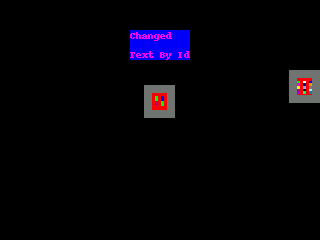

# Warning
This library is in the very early stages of development. Pretty much all aspects of it are subject to change at any time right now. And there are still very likely things not working properly.

# What it does
This library attempts to simplify the process of making Circuit Python projects that use displayio based visual interfaces.

The two primary ways we aim to do this are:
 
 - Provide a JSON based layout config system. Layouts can be stored seperately from the logic of the application and rendered with minimal python code. 
 - Provide a few Layout objects that will use some pre-defined techniques for positioning their sub_views
 
 This library will take a JSON layout file like this:
 ```JSON
 {
  "view_type": "AbsoluteLayout",
  "sub_views": [
    {
      "view_type": "Label",
      "id":"main_lbl",
      "attributes":{
        "anchored_position": ["DISPLAY_WIDTH/2", "DISPLAY_HEIGHT/8"],
        "color": "0xFF00FF",
        "anchor_point": [0.5, 0.0],
        "text": "1",
        "max_glyphs": 60,
        "background_color": "0x0000FF",
        "line_spacing": 1.8
      }
    },
    {
      "view_type": "Image",
      "id":"main_img",
      "attributes":{
        "image_file": "images/2bit.bmp",
        "x": "DISPLAY_WIDTH/2-WIDTH/2",
        "y":85,
        "padding": 16,
        "background_color": "0x777777"
      }
    },
    {
      "view_type": "OnDiskBitmap",
      "id":"main_img",
      "attributes":{
        "image_file": "images/4bit.bmp",
        "x": "DISPLAY_WIDTH-WIDTH",
        "y":70,
        "padding": 16,
        "background_color": "0x777777"
      }
    }
  ]
}

 ```
 And allow you to render it to the screen with some python code like this:
 ```python
import board
import displayio
from display_layouts.absolute_layout import AbsoluteLayout

f = open("layouts/simpletest.json", "r")
layout_str = f.read()
f.close()
main_layout = AbsoluteLayout(board.DISPLAY, layout_str)

board.DISPLAY.show(main_layout.view)

#main_layout.sub_view_by_index(0).label.text = "Changed Text\nBy Index"
main_layout.sub_view_by_id("main_lbl").label.text = "Changed\nText By Id"

while True:
    pass
```
The layout above would look like this:



For more examples see the [examples](examples) directory in the repo.

If you have any feedback about the project please get in touch I am curious to get input :)

Release Notes:
- 8/30/2020:
    - BitmapLabel implemented.
- 8/13/2020:
    - LinearLayout implemented and added to [LinearLayout Example](examples/display_layouts_linear_layout_test.py) and [linear_layout_test.json](examples/layouts/linear_layout_test.json) layout file. 
- 8/2/2020:
    - AbsoluteLayout has been refactored to only import other layout views if they are used within the json that it is inflating.
- 7/30/2020
    - SparkLine view_type implemented and added to [Sparkline Example](examples/display_sparkline_test.py) and [sparkline_test.json](examples/layouts/sparkline_test.json) layout file
- 7/4/2020
    - RasPi/Blinka test script to screenshot the example layouts
    - Adding screenshots to repo
- 6/27/2020:
    - Circle view_type implemented and added to [Shapes example](examples/display_layouts_shapes_test.py) and [shapes_test.json](examples/layouts/shapes_test.json) layout file
    - Triangle view_type implemented and added to [Shapes example](examples/display_layouts_shapes_test.py) and [shapes_test.json](examples/layouts/shapes_test.json) layout file
    - Button view_type implemented and added to [Button example](examples/display_button_test.py) and [button_test.json](examples/layouts/button_test.json) layout file
- 6/26/2020:
    - Shapes from the display_shapes library are now supported with `view_type` of `Line`, `Rect`, `RoundRect`, `Polygon`
    - [Shapes example](examples/display_layouts_shapes_test.py) and [layout file](examples/layouts/shapes_test.json)
    - `scale` attribute for LabelView
    - [Badge example](examples/display_layouts_badge_test.py) and [layout json](examples/layouts/badge_test.json)
- 6/25/2020:
    - `WIDTH` and `HEIGHT` are now supported in relavent attribute fields. They will refer to the final views size.
    - Complex attribute values where relavent now support by using sanitized `eval()`
    - [Unsave eval test](examples/display_layouts_test_unsafe_eval.py) and [layout file](examples/layouts/test_unsafe_eval.json)
